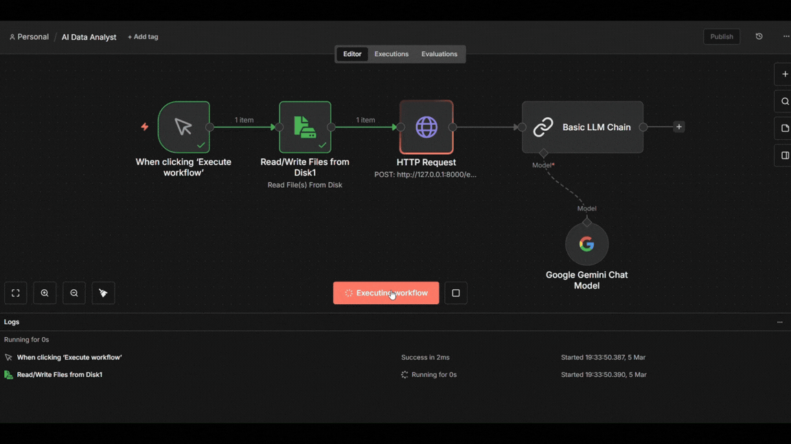
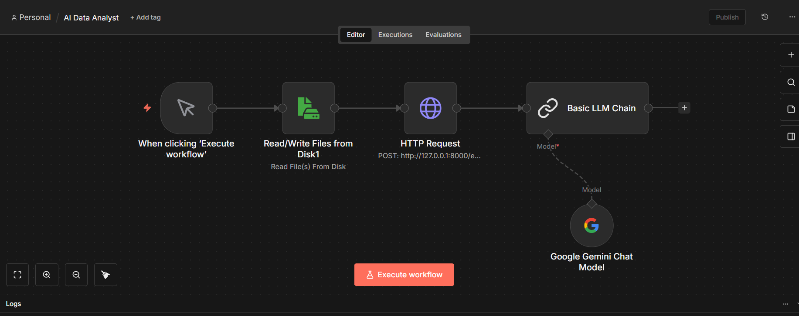
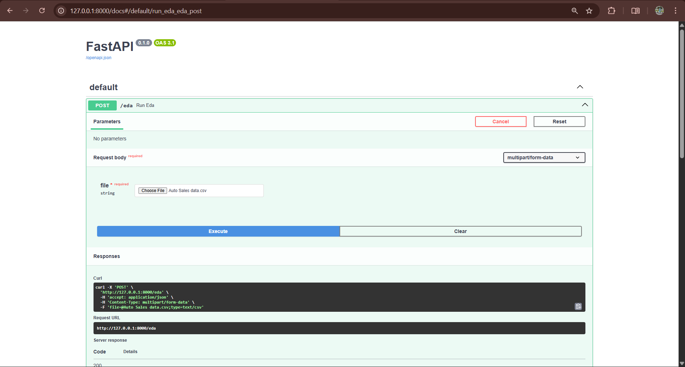

# AI Data Analyst Agent 🚀

[](https://www.python.org/) 
[](https://fastapi.tiangolo.com/) 
[](https://pandas.pydata.org/) 
[](https://matplotlib.org/) 
[](https://seaborn.pydata.org/) 
[](https://n8n.io/)
[](https://developers.generativeai.google/)

---

## 🌟 Project Overview

**AI Data Analyst Agent** is an **AI-powered automated data analysis platform** designed to make exploratory data analysis (EDA) faster, smarter, and more interactive.  

It allows users to:

- Upload any dataset
- Generate automatic visualizations and insights
- Export reports as PDFs
- Ask AI-driven queries about the data

This project is **ideal for recruiters and data-driven companies** as it demonstrates automation, AI integration, API design, and data visualization skills in one complete workflow.

---

## 📑 Table of Contents

| Section | Description |
|---------|-------------|
| [🌟 Project Overview](#-project-overview) | AI-powered EDA and automated insights platform |
| [🎮 Live Workflow](#-live-visual-workflow) | Real-time execution demo of the AI Agent |
| [🎯 Problem Statement](#-problem-statement) | Challenges in traditional EDA and the AI solution |
| [🛠 Features](#-features) | Smart EDA, AI insights, and PDF generation |
| [💻 Tech Stack](#-tech-stack) | Tools used (FastAPI, Pandas, Gemini AI, n8n) |
| [📂 Structure](#-project-structure) | Repository organization and file map |
| [🚀 Quick Start](#-quick-start) | Installation and local setup instructions |
| [📊 Screenshots](#-screenshots) | Visual look at the application interface |
| [💡 How it Works](#-how-it-works) | The 4-step processing pipeline |
| [🏆 Future Roadmap](#-future-improvements) | Planned features and scaling |
| [🌐 Socials](#-socials) | Contact information and portfolio links |


---

## 🎮 Live Visual Workflow

<div align="center">
  
  <p><i>Real-time execution of the AI Agent analyzing.</i></p>
</div>

---

## 🎯 Problem Statement

Traditional EDA and reporting can be:

- **Time-consuming** – manually creating charts for every dataset
- **Error-prone** – missing key insights or correlations
- **Non-interactive** – hard to answer custom queries dynamically
- **Disconnected from BI tools** – manual import/export needed for dashboards

**Solution:** Build a **single automated system** that handles EDA, visualization, AI-driven insights, and report generation in **one pipeline**, ready to integrate with BI dashboards like Power BI.

---

## 🛠 Features

- **Smart EDA**
  - Summary statistics for numeric & categorical features
  - Missing value analysis
  - Correlation analysis
- **Automated Visualizations**
  - Histograms, scatter plots, boxplots
  - Correlation heatmaps
  - Custom chart generation for selected fields
- **AI Insights**
  - Ask AI questions about dataset trends
  - Highlight important patterns, anomalies, and correlations
- **PDF Report Generation**
  - Auto-generate reports for selected fields
  - Include charts and summary tables
- **Workflow Automation**
  - n8n workflow automates dataset processing, AI insights, and dashboard updates
- **Modern Tech Stack**
  - FastAPI, Pandas, Matplotlib, Seaborn, Gemini AI, n8n

---

## 💻 Tech Stack
- **Backend & API**: Python, FastAPI
- **Data Processing & Visualization**: Pandas, Matplotlib, Seaborn
- **AI Insights:** Google Gemini AI
- **Automation:** n8n workflows
- **Report Generation:** PDF via  Matplotlib / ReportLab

---

## 📂 Project Structure

```text
AI-Data-Analyst-Agent/
├── eda_api.py            # FastAPI backend
├── requirements.txt      # Python dependencies
├── workflow_screenshot.png
├── fast-api.png
├── AI-Data-Analyst(demo).gif
├── workflow/            # n8n automation JSON file
|        └── AI-Data-Analyst.json
├── report/              # Generated PDF report
|        └── EDA_Report.pdf
├── dataset/             # Example CSV dataset
|        └── Auto-Sales-Data.csv
├── README.md
└── charts/
         ├── ORDERNUMBER_hist.png
         ├── PRICEEACH_hist.png
         └── QUANTITYORDERED_hist.png
```

---

## 🚀 Quick Start
**1. Clone Repository:**
```bash
git clone https://github.com/manas-shukla-101/AI-Data-Analyst-Agent.git
cd AI-Data-Analyst-Agent
```
**2. Install Dependencies:**
```bash
python -m venv venv
source venv/bin/activate   # Linux / Mac
venv\Scripts\activate      # Windows
pip install -r requirements.txt
```
**3. Run FastAPI Server**
```bash
uvicorn eda_api:app
```
> _Note: Inside the projects directory._

> _Access at: https://127.0.0.1:8000/docs_


**4. n8n Workflow**
- Import JSON workflow in n8n
- Trigger dataset upload
- Automated AI analysis, PDF, and Power BI export

**5. Upload the CSV file:**
- **Step1:** Click on _Try it Now_
- **Step2:** Upload the CSV file.
- **Step3:** Click on Execute.

---

## 📊 Screenshots
<div align="center">
  
  <p><i>Image of workflow of the AI-Data-Analyst-Agent</i></p>
</div>
<div align="center">
  
  <p><i>Backend Upload Process</i></p>
</div>


---

## 💡 How it Works
1. User uploads dataset → FastAPI backend processes CSV
2. Backend performs EDA → Generates charts & statistics
3. AI engine (Gemini) generates insights based on data trends
4. PDF report is generated → includes charts + summary

---

## 🔗 Useful Links

- [FastAPI Documentation](https://fastapi.tiangolo.com/)  
- [Pandas Documentation](https://pandas.pydata.org/)  
- [Seaborn Documentation](https://seaborn.pydata.org/)  
- [Google Gemini API](https://developers.generativeai.google/)  
- [Power BI](https://powerbi.microsoft.com/)  
- [n8n Automation](https://n8n.io/)  

---

## 📌 Notes
- Make sure to configure Gemini API keys for AI queries
- Power BI must have access to CSV files or API endpoints
- n8n workflows automate repetitive tasks but can be customized

---

## 🏆 Future Improvements
- Add real-time streaming analytics
- Integrate multi-dataset AI comparison
- Add interactive dashboards within FastAPI frontend
- Enhance PDF reporting with custom templates & branding
- Natural language dataset queries
- Power BI dashboard integration

---
---
**Made with ❤️ by Manas Shukla**

---

## 🌐 Socials:
[](https://manas-shukla-portfolio.framer.website/) [](https://instagram.com/manas_shukla_101) [](https://linkedin.com/in/manas-shukla-006774370) [](mailto:shuklamanas8928@gmail.com) 

---


